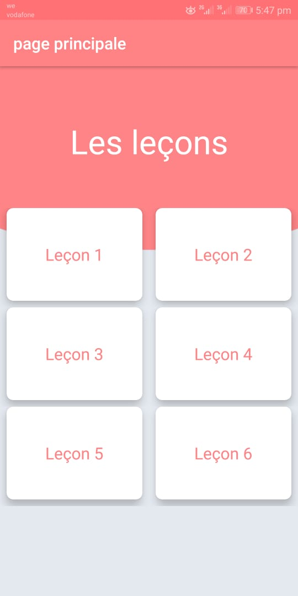
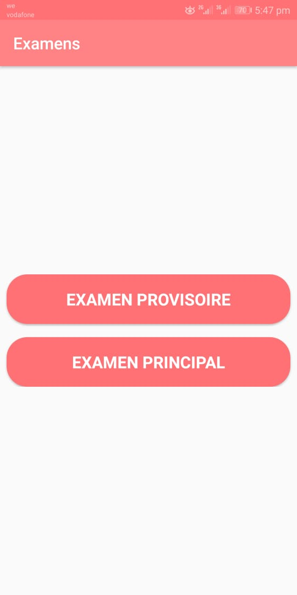
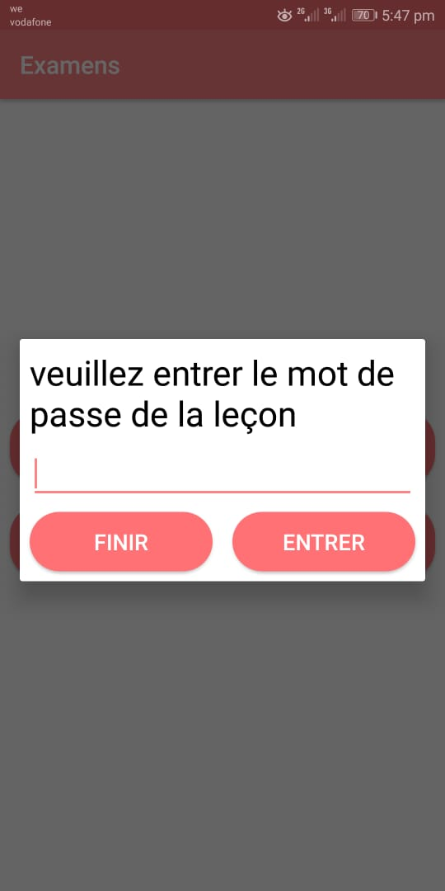
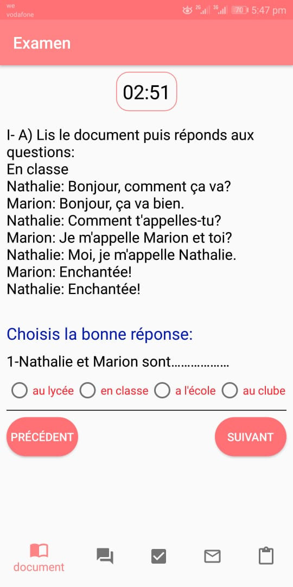
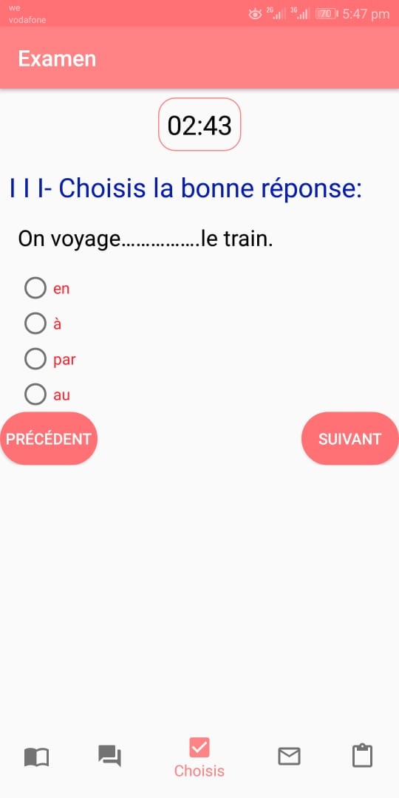
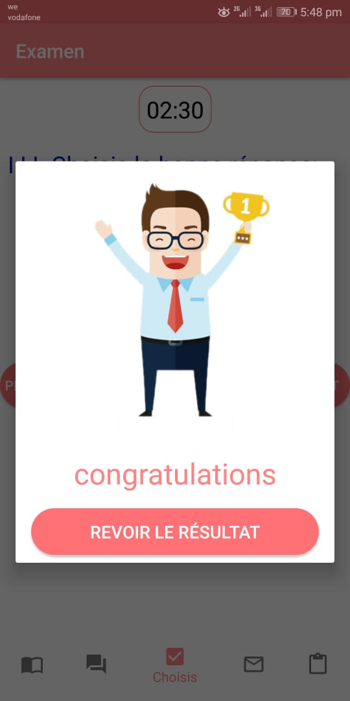
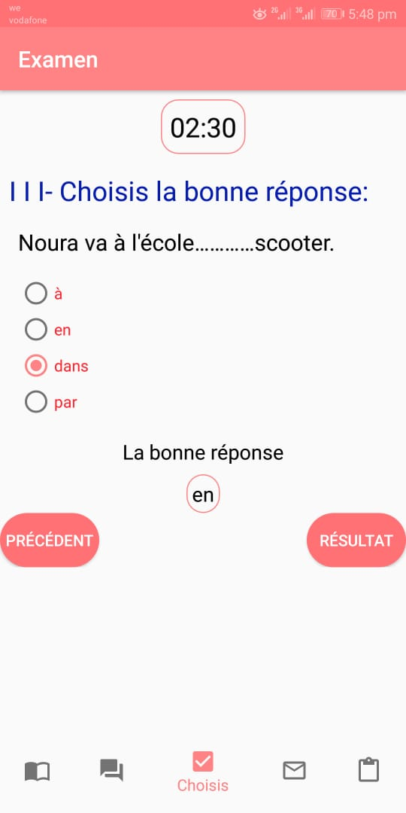
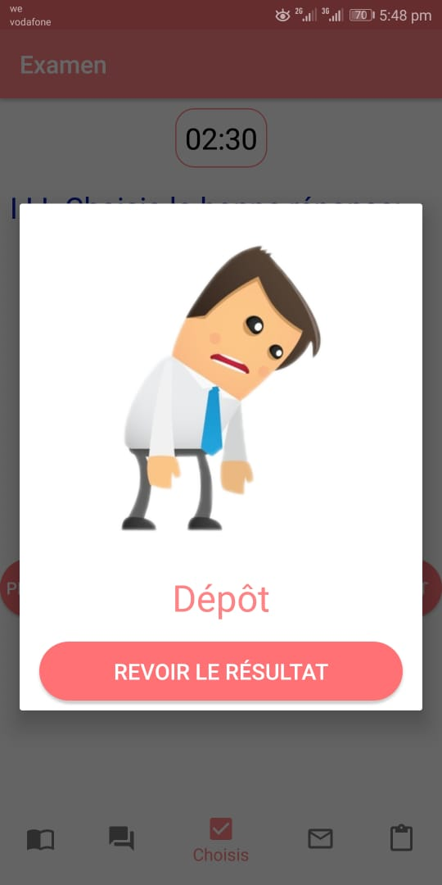

# FrinshExamsApp

This app is designed to help french language teachers to add exams to students to solve them. 

Every exam have enough time to solve it.

This app support auto correction for this exams.

screenshots:

note : this app still under development. 

